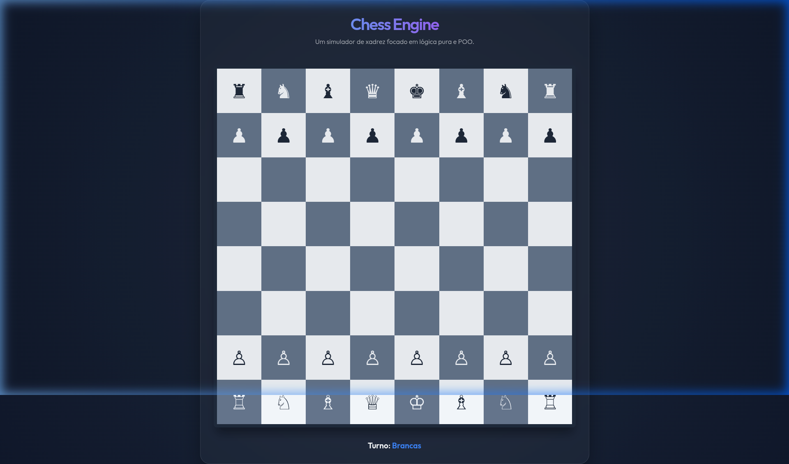

# ♟️ Chess Engine Simulator

Este projeto é um simulador de xadrez completo, desenvolvido com foco em **Lógica Pura**, **Estruturas de Dados Eficientes** e **Programação Orientada a Objetos (POO)**. Mais do que um simples jogo, este repositório demonstra a capacidade de traduzir regras complexas do mundo real em um sistema de software robusto e escalável.

---

## 🚀 Por que este projeto é um "Teste de Lógica Pura"?

Desenvolver um motor de xadrez exige lidar com um espaço de estados massivo e regras altamente condicionais. Este simulador resolve desafios críticos de engenharia de software:

### 1. Validação de Movimentos (O Algoritmo de "Ghost Moves")
Como saber se um movimento é legal? No xadrez, não basta a peça poder "pular" para uma casa; o movimento não pode deixar o próprio Rei em xeque.
- **Implementação**: Para cada movimento potencial, o motor cria uma simulação ("Ghost Move") em uma cópia virtual do tabuleiro.
- **Verificação**: O estado resultante é analisado. Se o Rei estiver sob ataque de qualquer peça adversária após o movimento, o movimento é descartado como ilegal.

### 2. Separação de Responsabilidades (Clean Code)
O projeto foi refatorado de um script procedural monolítico para uma arquitetura modular baseada em classes ES6:

- **`Piece` (Base Class)**: Define a interface comum para todas as peças (cor, posição, tipo).
- **Subclasses (`Pawn`, `Knight`, etc.)**: Cada peça encapsula sua própria lógica de movimentação específica (ex: o Knight usa offsets em 'L', enquanto o Bishop usa vetores de deslizamento).
- **`Board`**: Gerencia a matriz 8x8 (representada como um array linear de 64 posições para performance) e o estado das casas.
- **`Game`**: O "Cérebro" do sistema. Controla o fluxo de turnos, histórico de jogadas e detecção de Check/Checkmate.
- **`UI`**: Desacoplada da lógica de jogo, lida apenas com a renderização e captura de eventos do usuário.

### 3. Detecção de Xeque-Mate
O algoritmo de Checkmate verifica recursivamente se:
1. O Rei está em xeque.
2. Não existe **nenhum** movimento possível para **nenhuma** peça do jogador atual que resulte em um estado onde o Rei não esteja em xeque.
Isso envolve processar todos os movimentos legais de todas as peças ativas, demonstrando eficiência algorítmica.

---

## 🎨 Design Premium
O simulador conta com uma interface moderna e minimalista:
- **Estética Dark Mode**: Utiliza uma paleta de cores Slate e Blue, inspirada em ambientes de desenvolvimento modernos.
- **Glassmorphism**: Efeitos de transparência e desfoque no container principal.
- **Feedback Visual**: Destaque dinâmico para peças selecionadas e movimentos legais.

---

## 🛠️ Tecnologias Utilizadas
- **JavaScript (ES6+)**: Módulos, Classes e lógica funcional.
- **HTML5 Semantic**: Estrutura acessível e limpa.
- **Vanilla CSS**: Estilização avançada sem frameworks, provando domínio técnico de layouts.

---

## 📖 Como Rodar
Como o projeto utiliza **ES6 Modules**, ele precisa ser servido via HTTP (requisito de segurança dos browsers modernos).

1. Clone o repositório.
2. Na pasta raiz, rode um servidor local (ex: `npx serve` ou a extensão Live Server do VS Code).
3. Acesse no browser via `http://localhost:3000` (ou a porta indicada).

---

## 👨‍💻 Autor
Desenvolvido por **Luan Estifer**.
Conecte-se comigo no [LinkedIn](https://www.linkedin.com/in/luan-estifer-rodrigues-pereira-7577a2285/).
